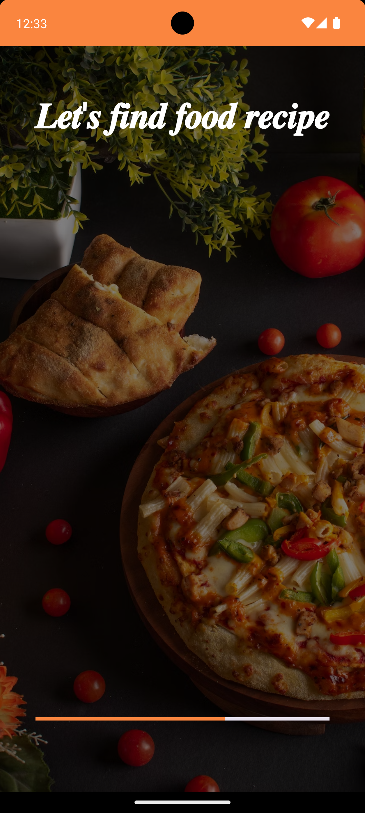
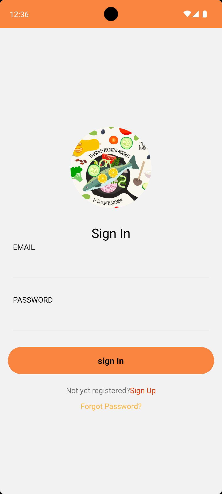
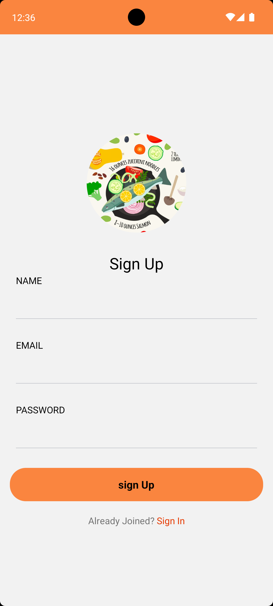
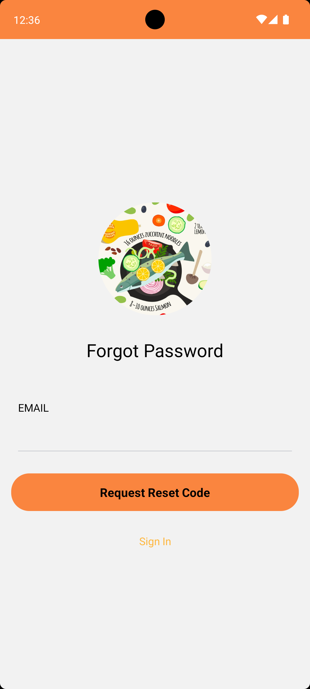
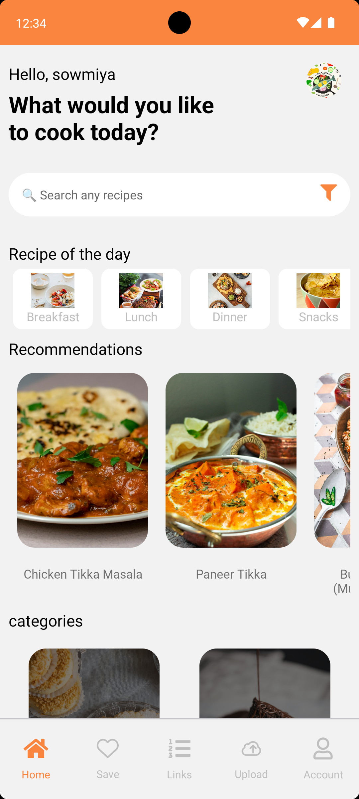
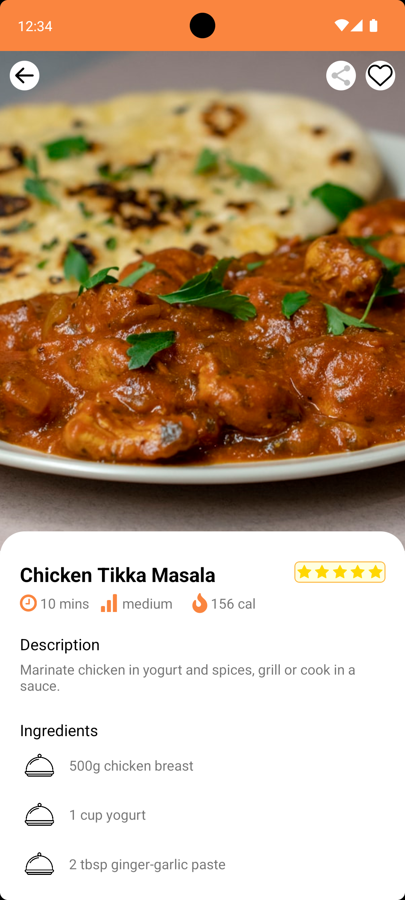
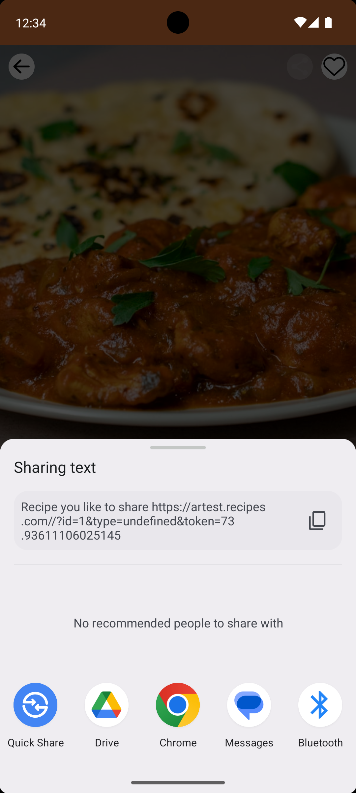
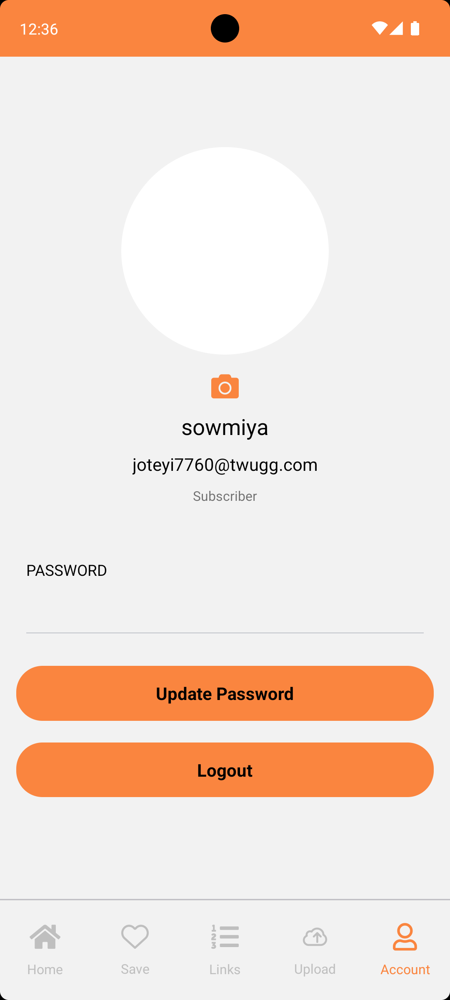

# DishDelight_RN

# DishDelight - Recipe Sharing & Discovery Platform 🍲📱
 DishDelight is a React Native mobile application crafted for food lovers to explore, share, and upload various recipes. Built with a Node.js and MongoDB backend, DishDelight is designed to bring together culinary enthusiasts, offering a seamless platform for discovering and showcasing diverse dishes worldwide.

# Technologies Used💻🛠️

## Frontend
React Native for a smooth, cross-platform user experience.
## Backend
Node.js and MongoDB, ensuring scalability and efficient data management.
## Email
SendGrid

# Screenshots

<table>
  <tr>
    <td></td>
    <td></td>
  </tr>
  <tr>
    <td></td>
    <td></td>
  </tr>
  <tr>
    <td></td>
    <td></td>
  </tr>
  <tr>
    <td></td>
    <td></td>
  </tr>
</table>
